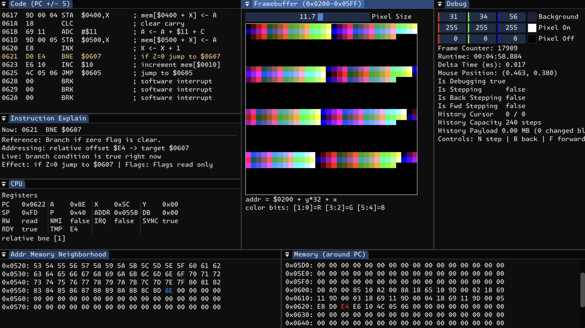
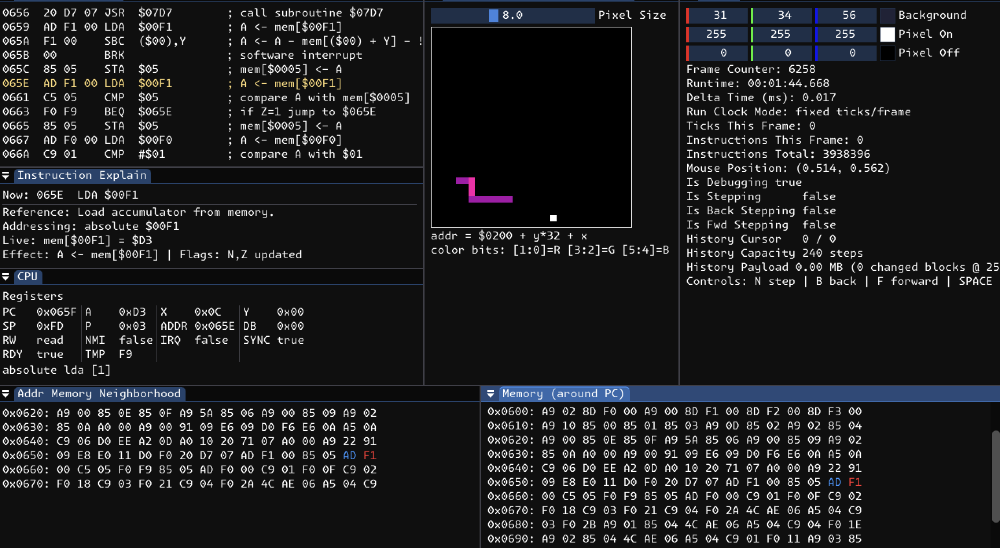
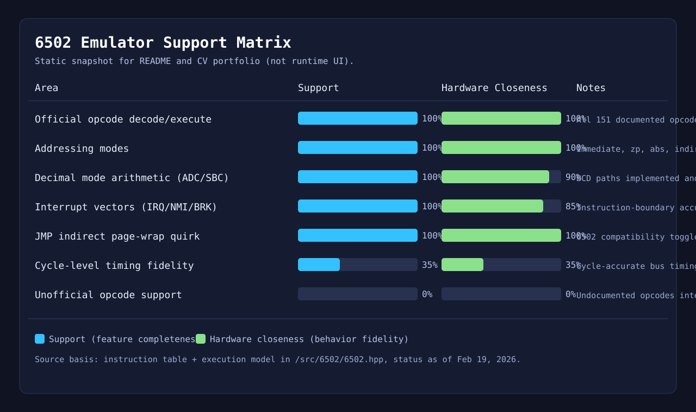

# 6502 Emulator

OpenGL + SDL2 + Dear ImGui MOS 6502 emulator/debugger.

## Current status
- Opcode table: official 151 opcodes mapped.
- Instruction families: implemented in `exec_func` (`src/6502/6502.hpp`).
- Addressing modes: implemented (`immediate`, `zero_page*`, `absolute*`, `indirect*`, `relative`, `accum`, `implied`).
- Debug UI: register view, memory windows, framebuffer view, disassembly with inline comments, and an `Instruction Explain` panel with 3-4 human-readable lines using live register/memory values.
- Dear ImGui docking enabled for a cleaner, dockable debugger layout.
- Static support matrix image for portfolio/CV presentation.

## Screenshots
**Debugger / basic view**



**6502 Snake demo**



## Progress Tracker


## Known limitations
- Timing is not cycle-accurate yet.
- Interrupt handling is instruction-boundary accurate (`IRQ`/`NMI` vectors + stack/status push), but not cycle-accurate bus timing.
- Unofficial/undocumented opcodes are intentionally not implemented.

## Build requirements
- CMake 3.16+
- C++23 compiler
- Python 3 (used by `build.sh` to generate `assets/sound/beep.wav`)
- Internet access on first configure (CMake `FetchContent` pulls dependencies from GitHub)

## Build and run
```bash
./build.sh
./build/main
```

Precompiled headers are enabled by default. To disable:
```bash
cmake -S . -B build -DENABLE_PCH=OFF
```

Or use:
```bash
./cnr
```

## Tests
```bash
cmake -S . -B build
cmake --build build --target cpu_tests
ctest --test-dir build --output-on-failure
```

Third-party adapted tests and vectors in `tests/cpu_tests.cpp` are attributed to py65.
The BSD-3-Clause notice is included at `tests/third_party/py65.LICENSE`.

## Controls
- `SPACE`: toggle run/debug mode
- `N`: single-step one CPU tick
- `B`: step back
- `F`: step forward (redo)
- `I`: toggle IRQ line
- `M`: pulse NMI
- `T`: toggle real-time 6502 clock mode (~1 MHz)
- `Arrow keys` / `WASD`: snake direction (written to `$00F0`)
- `R`: reset demo
- `ESC`: quit

Debug stepping keeps a fixed-capacity timeline (`240` steps by default) and stores RAM changes as block deltas (`256`-byte blocks) instead of full 64KB snapshots per step.

## Included runnable demo
- Loads a generated **6502 snake** program at `$0600`
- Uses `$0200-$05FF` as a 32x32 pixel framebuffer
- Snake game logic runs on the emulated CPU (movement, tail follow, collision, food placement)
- Host I/O bridge (memory-mapped):
  - `$00F0`: requested direction (`1=up 2=right 3=down 4=left`)
  - `$00F1`: host tick counter (increments every snake step interval)
  - `$00F2`: score mirror
  - `$00F3`: state (`0=running 1=game over`)

## References
- [Datasheet](https://web.archive.org/web/20221029042234if_/http://archive.6502.org/datasheets/mos_6500_mpu_preliminary_may_1976.pdf)
- [Instruction Set](https://www.masswerk.at/6502/6502_instruction_set.html)
- [Emulating a 6502 System in JavaScript • Matt Godbolt • GOTO 2016](https://www.youtube.com/watch?v=7WuRq-Wmw5o)
- [Basics - 6502 Assembly Crash Course 01](https://www.youtube.com/watch?v=yEiNs7pKNh8)
- [The first LowSpec Processor](https://www.youtube.com/watch?v=lP2ZBp9O0mk)
- [The 6502 CPU Powered a Whole Generation!](https://www.youtube.com/watch?v=acUH4lWe2NQ)
- [“Hello, world” from scratch on a 6502 — Part 1](https://www.youtube.com/watch?v=LnzuMJLZRdU)
- [Software Emulators vs FPGAs](https://www.youtube.com/watch?v=sMMiBEhnizE)
- [Advanced 6502 Assembly Programming for the Apple II](https://www.youtube.com/watch?v=WEliEAc3ZyA)
- [27c3: Reverse Engineering the MOS 6502 CPU (en)](https://www.youtube.com/watch?v=fWqBmmPQP40)

## Credits
- Font: Monaspace Krypton
- License: SIL Open Font License 1.1
- Source: https://monaspace.githubnext.com/
